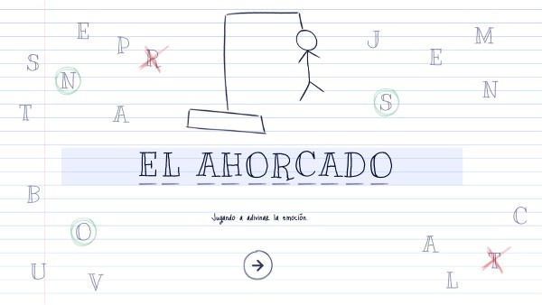

# Juego del Ahorcado en Python



=====================================

Este proyecto es una implementación del juego clásico del Ahorcado en Python. El juego permite a los jugadores adivinar palabras, mientras se muestra una figura de un muñeco del ahorcado que progresa con cada intento fallido.

Requisitos:

- Archivos JSON:
  - `data.json`: Contiene las palabras del juego.
  - `scores.json`: Almacena los puntajes de los jugadores.

## Integrantes

    -Insua Fabricio

    -Belen Francisco

### Descripción del Código

El código del juego consta de varias funciones y estructuras que gestionan la carga de datos, el flujo del juego, la actualización del puntaje y la visualización de la figura del ahorcado. A continuación describimos las funciones principales y su funcionamiento:

## 1. **Carga de palabras (`cargar_palabras`)**

Esta función carga las palabras que se utilizarán en el juego desde un archivo JSON. El archivo `data.json` debe contener una lista de palabras bajo la clave `"ahorcado"`. La función selecciona una palabra aleatoria para que el jugador la adivine.

    ```python
    def cargar_palabras(palabra):
        try:
            with open(palabra, "r", encoding="utf-8") as file:
                data = json.load(file)  # Cargar el JSON completo
                return data.get("ahorcado", [])  # Acceder a la clave "ahorcado"
        except FileNotFoundError:
            print(f"El archivo {palabra} no existe.")
            return []
        except json.JSONDecodeError:
            print(f"Error al leer el archivo {palabra}. Verifica el formato.")
            return []

## 2. Carga y almacenamiento de puntajes (`cargar_puntajes`, `guardar_puntajes`)

Estas funciones manejan la carga de puntajes desde el archivo scores.json y el almacenamiento de nuevos puntajes al final de cada partida. Solo se guardan los 5 mejores puntajes.

    ```python
    def cargar_puntajes(palabra):
        try:
            with open(palabra, "r", encoding="utf-8") as file:
                return json.load(file)  # Cargar la lista de puntajes
        except FileNotFoundError:
            return []  # Si el archivo no existe, retornamos una lista vacía
        except json.JSONDecodeError:
            print(f"Error al leer el archivo {palabra}. Verifica el formato.")
            return []

    def guardar_puntajes(archivo, puntajes_existentes):
        # Guardar el archivo con los puntajes actualizados, sin sobrescribir los anteriores
        with open(archivo, "w", encoding="utf-8") as file:
            json.dump(puntajes_existentes, file, indent=4)

## 3. Mostrar la figura del ahorcado (`mostrar_monigote`)

Esta función muestra el progreso del muñeco del ahorcado, representado mediante una lista de cadenas de texto. Cada vez que el jugador falla un intento, el muñeco se va completando, mostrando la figura con partes del cuerpo (cabeza, cuerpo, brazos y piernas).

    ```python
    def mostrar_monigote(intentos_restantes):
        muñeco = [
            """
            ════════
            |      ║
                   ║
                   ║
                   ║
                   ║
        ════════════
            """,
            """
            ════════
            |      ║
            O      ║
                   ║
                   ║
                   ║
        ════════════
            """,
            """
            ════════
            |      ║
            O      ║
            |      ║
                   ║
                   ║
        ════════════
            """,
            """
            ════════
            |      ║
            O      ║
           /|      ║
                   ║
                   ║
        ════════════
            """,
            """
            ════════
            |      ║
            O      ║
           /|\     ║
                   ║
                   ║
        ════════════
            """,
            """
            ════════
            |      ║
            O      ║
           /|\     ║
           /       ║
                   ║
        ════════════
            """,
            """
            ════════
            |      ║
            O      ║
           /|\     ║
           / \     ║
                   ║
        ════════════
            """
        ]
        
        # Mostrar la parte del muñeco correspondiente al intento fallido
        print(muñeco[6 - intentos_restantes])  # Seleccionar el muñeco de acuerdo con los intentos restantes

## 4. Lógica del juego (`jugar`)

En esta función se gestiona el juego en sí. El jugador selecciona letras para adivinar una palabra. Cada vez que el jugador acierta, la letra se revela en la palabra oculta. Si falla, el muñeco del ahorcado se va completando. El juego termina cuando el jugador adivina la palabra o se queda sin intentos.

    ```python
    def jugar(palabras, puntajes):
        idioma = input("Seleccione el idioma (es/en): ").strip().lower()
        palabra_clave = "ES" if idioma == "es" else "EN"
        palabra_seleccionada = random.choice(palabras)[palabra_clave].lower()
        palabra_oculta = ["_" for _ in palabra_seleccionada]
        letras_usadas = set()
        intentos_restantes = 6
        puntaje = 0
        
        while intentos_restantes > 0 and "_" in palabra_oculta:
            print("\nPalabra:", " ".join(palabra_oculta))
            print("Letras usadas:", ", ".join(sorted(letras_usadas)))
            print("Intentos restantes:", intentos_restantes)
            mostrar_monigote(intentos_restantes)  # Mostrar la horca y el monigote
            
            letra = input("Introduce una letra: ").strip().lower()
            
            # Verificar que solo se ingrese una letra
            if len(letra) != 1 or not letra.isalpha():
                print("Por favor, ingresa solo una letra válida.")
                continue
            
            if letra in letras_usadas:
                print("¡Ya usaste esa letra! Intenta con otra.")
                continue
            
            letras_usadas.add(letra)
            
            if letra in palabra_seleccionada:
                print("¡Bien hecho! Adivinaste una letra.")
                for i, l in enumerate(palabra_seleccionada):
                    if l == letra:
                        palabra_oculta[i] = letra
                        puntaje += 1
            else:
                print(f"Letra incorrecta. Te quedan {intentos_restantes - 1} intentos.")
                intentos_restantes -= 1
                mostrar_monigote(intentos_restantes)  # Solo mostrar monigote cuando haya un fallo
        
        if "_" not in palabra_oculta:
            print("¡Ganaste! La palabra era:", palabra_seleccionada, "y tu puntuación es:", puntaje * 2)
            puntaje += len(palabra_seleccionada)  # Aseguramos que el puntaje se sume al ganar
        else:
            print("¡Perdiste! La palabra era:", palabra_seleccionada)
        
        nombre = input("Introduce tu nombre: ").strip()
        puntajes.append({"nombre": nombre, "puntaje": puntaje, "palabra": palabra_seleccionada})
        
        # Ordenar puntajes de mayor a menor
        puntajes_ordenados = sorted(puntajes, key=lambda x: x["puntaje"], reverse=True)
        
        # Guardar solo los 5 mejores puntajes
        guardar_puntajes("Juego el ahorcado\\scores.json", puntajes_ordenados[:15])
        
        print("¡Puntaje guardado!")

## 5. Menú Principal y Puntajes (`mostrar_menu`, `mostrar_puntajes`)

La función mostrar_menu muestra el menú principal del juego, permitiendo al jugador elegir entre jugar, ver los puntajes o salir. La función mostrar_puntajes muestra los 5 mejores puntajes de todos los jugadores.

    ```python
    def mostrar_menu():
        print("\n--- Menú Principal ---")
        print("1. Jugar")
        print("2. Puntajes")
        print("3. Salir")
        return input("Seleccione una opción: ")

    def mostrar_puntajes(puntajes):
        print("\n--- Mejores Puntajes ---")
        puntajes_ordenados = sorted(puntajes, key=lambda x: x["puntaje"], reverse=True)[:5]
        for idx, score in enumerate(puntajes_ordenados, start=1):
            print(f"{idx}. {score['nombre']} - {score['puntaje']} puntos - Palabra: {score['palabra']}")

## 6. Función Principal (`main`)

La función main maneja la interacción con el jugador. Se encargará de cargar las palabras y los puntajes, y de llamar a las funciones correspondientes según la opción seleccionada por el jugador.

    ```python
    def main():
        palabras = cargar_palabras("Juego el ahorcado\\data.json")
        puntajes = cargar_puntajes("Juego el ahorcado\\scores.json")
        
        while True:
            opcion = mostrar_menu()
            
            if opcion == "1":
                jugar(palabras, puntajes)
            elif opcion == "2":
                mostrar_puntajes(puntajes)
            elif opcion == "3":
                print("¡Gracias por jugar!")
                break
            else:
                print("Opción no válida.")

## `salida del juego`
  
    ```python
    --- Menú Principal ---
    1. Jugar
    2. Puntajes
    3. Salir
    Seleccione una opción: 1
    Seleccione el idioma (es/en): es

    Palabra: _ _ _ _ _ _ _ _ _
    Letras usadas:
    Intentos restantes: 6     

            ════════ 
            |   ║
                ║
                ║
                ║
                ║
        ════════════        

    Introduce una letra:      

### `Archivo data.json`

    {
        "ahorcado": [
            {"id": 1,"ES": "elefante","EN": "elephant"},
            {"id": 2,"ES": "departamento","EN": "department"},
            {"id": 3,"ES": "medicina","EN": "medicine"},
            {"id": 4,"ES": "ingenieria","EN": "engineering"},
            {"id": 5,"ES": "computadora","EN": "computer"},
            {"id": 6,"ES": "dispositivo","EN": "device"},
            {"id": 7,"ES": "software","EN": "software"},
            {"id": 8,"ES": "hardware","EN": "hardware"},
            {"id": 9,"ES": "idioma","EN": "language"},
            {"id": 10,"ES": "ciudadano","EN": "citizen"},
            {"id": 11,"ES": "universidad","EN": "university"},
            {"id": 12,"ES": "biblioteca","EN": "library"},
            {"id": 13,"ES": "diplomacia","EN": "diplomacy"},
            {"id": 14,"ES": "astronomia","EN": "astronomy"},
            {"id": 15,"ES": "filosofia","EN": "philosophy"},
            {"id": 16,"ES": "tecnologia","EN": "technology"},
            {"id": 17,"ES": "programacion","EN": "programming"},
            {"id": 18,"ES": "matematicas","EN": "mathematics"},
            {"id": 19,"ES": "ciencia","EN": "science"},
            {"id": 20,"ES": "historia","EN": "history"},
            {"id": 21,"ES": "geografia","EN": "geography"},
            {"id": 22,"ES": "electricidad","EN": "electricity"},
            {"id": 23,"ES": "quimica","EN": "chemistry"},
            {"id": 24,"ES": "biologia","EN": "biology"},
            {"id": 25,"ES": "ingeniero","EN": "engineer"}
        ]
    }

### `Archivo scores.json`

    [
    {
        "nombre": "fabriu","puntaje": 22,"palabra": "computadora"
    },
    {
        "nombre": "tizi","puntaje": 22,"palabra": "universidad"
    },
    {
        "nombre": "lucas","puntaje": 18,"palabra": "ciudadano"
    },
    {
        "nombre": "pepe","puntaje": 16,"palabra": "elefante"
    },
    {
        "nombre": "nico","puntaje": 16,"palabra": "biologia"
    }
]
